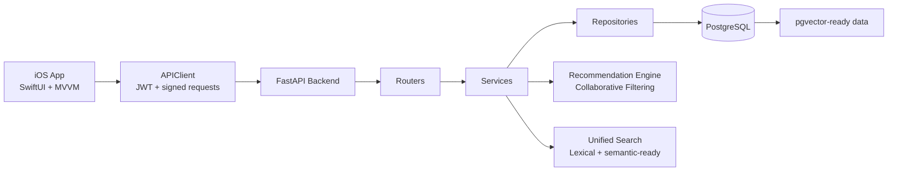

# YemeksepetiApp

YemeksepetiApp is a multi-role food ordering platform built with a native SwiftUI client and a FastAPI backend. The project combines customer ordering flows, store-owner operations, and administrator controls in a single product, while also layering in personalized recommendations, unified search, and transport-level request signing.

The repository is structured as a production-style application rather than a demo. It includes a mobile app, a modular backend, a PostgreSQL-based data model, Dockerized local development, and a screenshot archive that documents the implemented user experience.

## Highlights

- Native iOS application built with SwiftUI and MVVM.
- FastAPI backend organized by routers, services, repositories, models, and schemas.
- PostgreSQL + SQLAlchemy data layer with pgvector-ready recommendation/search support.
- Role-based workflows for customers, store owners, and administrators.
- Unified search that blends standard query flow with semantic retrieval infrastructure.
- Personalized recommendations powered by time-aware collaborative filtering with fallback strategies.
- JWT-based authentication, role-based authorization, and signed-request middleware for added request integrity.
- Docker-based local backend stack for reproducible development.

## Product Scope

### Customer experience

- Browse restaurants and menus.
- Search restaurants and menu items from a single search flow.
- Save and manage delivery addresses.
- Build a cart with restaurant-specific ordering rules.
- Apply coupons during checkout.
- Track order history and submit structured reviews.
- Receive personalized and time-aware food recommendations.

### Store-owner operations

- Manage restaurant information and menu items.
- Publish and maintain coupons.
- Review incoming orders and operational activity.
- Monitor customer feedback inside the restaurant context.

### Admin operations

- Manage users and role assignments.
- Manage restaurant activation and platform visibility.
- Inspect platform-level lists, filters, and operational statistics.

## Architecture



## Technology Stack

| Layer | Stack |
| --- | --- |
| Mobile | SwiftUI, Combine-style state propagation, MVVM |
| Backend | FastAPI, Pydantic, async SQLAlchemy |
| Database | PostgreSQL, JSONB, pgvector-ready modeling |
| Auth | JWT, bcrypt, role-based authorization |
| Transport security | HMAC-SHA256 signed requests with nonce and timestamp validation |
| Recommendations | User-based collaborative filtering, cosine similarity, time segmentation, fallback popular-now logic |
| Search | Unified search endpoint with lexical and semantic-oriented infrastructure |
| Local development | Docker, docker-compose |

## Repository Layout

```text
yemeksepetiApp/
├── backend/
│   ├── app/
│   │   ├── core/
│   │   ├── models/
│   │   ├── repositories/
│   │   ├── routers/
│   │   ├── schemas/
│   │   └── services/
│   ├── migrations/
│   ├── docker-compose.yml
│   └── .env.example
├── yemeksepetiApp/
│   ├── Models/
│   ├── Services/
│   ├── ViewModels/
│   └── Views/
├── ss/
└── yemeksepetiApp.xcodeproj/
```

## Implemented Backend Modules

- `auth`: registration, login, credential updates.
- `users`: current user profile and address management.
- `restaurants`: public listing, restaurant detail, owner-side management, menu operations, reviews.
- `orders`: create order, fetch order history, update status, cancellation flow, review submission.
- `coupons`: public coupons, code-based validation, owner management.
- `recommendations`: personalized recommendations, popular-now, menu similarity, batch embedding generation.
- `search`: unified search for restaurants and menu items.
- `admin`: user, restaurant, and platform management endpoints.

## Security Model

This repository is prepared for public sharing without shipping runtime secrets.

- Sensitive runtime values live in local environment files and are not committed.
- The repository includes `backend/.env.example` for configuration shape only.
- JWT is used for authentication.
- Passwords are expected to be stored with bcrypt hashing.
- Role-based access control separates customer, store-owner, and admin capabilities.
- Signed-request middleware validates bearer-token requests using timestamp, nonce, and HMAC-SHA256 signatures to harden replay protection.

## Recommendation and Search Approach

The project intentionally separates discovery from personalization:

- Unified search serves restaurant and menu retrieval through a single API flow.
- The recommendation layer focuses on user behavior rather than only product text similarity.
- Personalized suggestions are generated through user-based collaborative filtering with cosine similarity.
- Recommendations are segmented by time-of-day to better match food-ordering behavior.
- Cold-start and sparse-history cases fall back to popular items for the active time window.
- The backend still includes embedding-oriented infrastructure for semantic retrieval and menu similarity scenarios.

## Local Development

### Backend

1. Copy the example environment file.
2. Fill in your own local or remote database and JWT values.
3. Start the backend stack with Docker.

```bash
cd backend
cp .env.example .env
docker compose up -d --build
```

Useful endpoints after startup:

- `http://localhost:8000/health`
- `http://localhost:8000/docs`

### iOS client

The mobile client is a native Xcode project and should be built on macOS.

1. Open `yemeksepetiApp.xcodeproj` in Xcode.
2. Set `API_BASE_URL` if you do not want to use the configured default base URL.
3. Run the app on a simulator or device.

## Screenshot Gallery

The `ss/` directory contains the full screenshot archive collected during development. The gallery below highlights representative implemented flows from the product UI.

<table>
  <tr>
    <td align="center"><strong>Personalized home feed</strong><br/></td>
    <td align="center"><strong>Search results</strong><br/></td>
    <td align="center"><strong>Restaurant detail</strong><br/></td>
  </tr>
  <tr>
    <td align="center"><strong>Menu item listing</strong><br/></td>
    <td align="center"><strong>Address management</strong><br/></td>
    <td align="center"><strong>Order history and review</strong><br/></td>
  </tr>
  <tr>
    <td align="center"><strong>Coupon management</strong><br/></td>
    <td align="center"><strong>Admin restaurant panel</strong><br/></td>
    <td align="center"><strong>Account area</strong><br/></td>
  </tr>
</table>

## Notes for Contributors

- Do not commit `.env`, service account files, private keys, or client secrets.
- Use `backend/.env.example` as the source of truth for required environment variables.
- Keep generated backups, local notes, and one-off internal documents outside version control.
